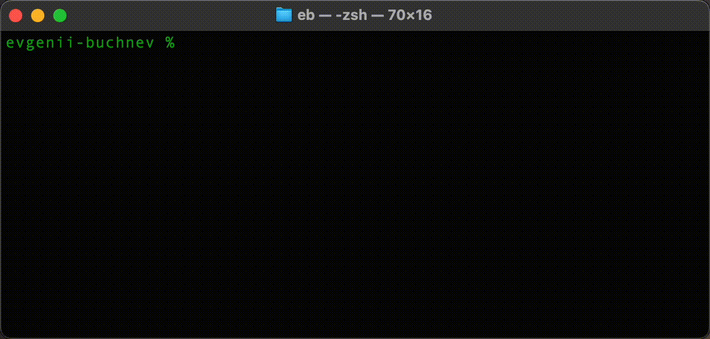

# shell-menu
shell-menu - a simple shell script to show a menu and select one option to pass it further down the pipe.

## Example

See `example-inventory.sh` and `example-ssh-config` for a configuration.



## Installation to .ssh folder

To install/update `shell-menu` into your `.ssh` folder, you can use the following one-liner:

```sh
curl -o ~/.ssh/shell-menu https://raw.githubusercontent.com/evgeniibuchnev/shell-menu/master/shell-menu && chmod +x ~/.ssh/shell-menu
```
