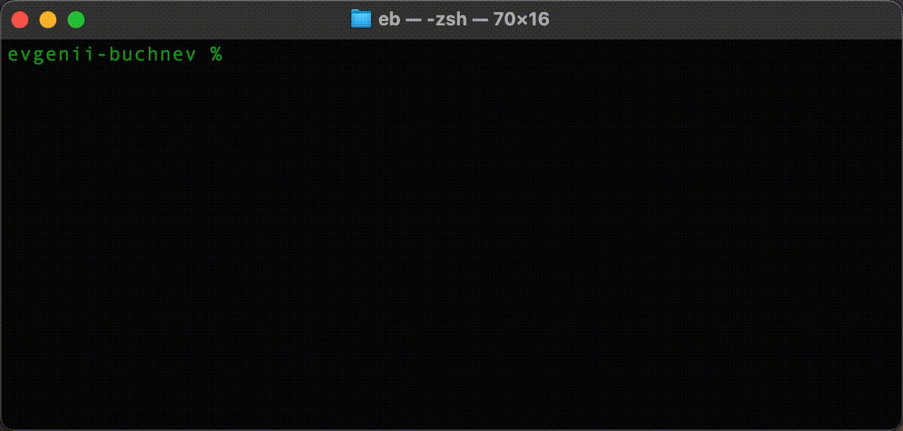

# shell-menu

`shell-menu` is a simple shell script that displays a numbered menu and passes the selected option to stdout.  
It accepts newline-separated input from stdin or as command-line arguments, making it easy to integrate into scripts and pipelines.



## Usage

```sh
# From a pipe
printf 'Apple\nBanana\nOrange\n' | shell-menu

# From a file
cat items_list.txt | shell-menu

# From arguments
shell-menu $'Apple\nBanana\nOrange'
```

Enter `0` or `q` to exit without selecting an option.

## Examples

### Selecting a host from an inventory list

`example-inventory.sh` outputs a list of hosts. Pipe it into `shell-menu` to select one interactively:

```sh
./example-inventory.sh | shell-menu
```

### Using with SSH ProxyCommand

`example-ssh-config` shows how to use `shell-menu` inside `~/.ssh/config` to interactively pick a host at connection time.

Copy the example files to `~/.ssh/`:

```sh
cp example-inventory.sh ~/.ssh/
```

Add the following to `~/.ssh/config`:

```
Host webserver
  User admin
  IdentityFile ~/.ssh/your-key
  PreferredAuthentications publickey
  ServerAliveInterval 50
  ProxyCommand bash -c "nc $( ~/.ssh/example-inventory.sh | shell-menu ) %p"
```

Now running `ssh webserver` will display a menu to choose which host to connect to.

## Installation

To install or update `shell-menu` system-wide (default: `/usr/local/sbin`), use one of the following one-liners:

```sh
curl -s https://raw.githubusercontent.com/evgeniibuchnev/shell-menu/master/install.sh | bash
```

```sh
wget -qO- https://raw.githubusercontent.com/evgeniibuchnev/shell-menu/master/install.sh | bash
```

To install into a custom directory, pass the target path as the first argument:

```sh
curl -s https://raw.githubusercontent.com/evgeniibuchnev/shell-menu/master/install.sh | bash -s -- "$HOME/.local/bin"
```

Depending on the destination directory, `sudo` may be required.
